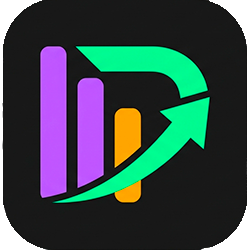

import base64

# Create a beautifully styled README.md content tailored to the "Painel do Devedor" project
# 📊 Painel do Devedor

> Uma interface fintech moderna, leve e responsiva para visualização de débitos, cálculo de juros e simulação de quitação de dívidas.

A proposta do **Painel do Devedor** é transformar a experiência de negociação de dívidas. Em vez de uma abordagem punitiva, o sistema oferece uma ferramenta de parceria e transparência, permitindo que o usuário visualize o que falta pagar, simule cenários com juros e planeje a sua liberdade financeira.

---

## 🎨 Identidade Visual & Design

O projeto foi construído sob o conceito de **Fintech Dark Mode**, utilizando uma paleta de cores neon de alto contraste para destacar métricas financeiras essenciais:

* 🟩 **Verde Quitação (`#00ff9d` / `#4cff7a`)**: Usado para valores, pagamentos e saldo total positivo.
* 🟧 **Laranja Alerta (`#ff9d00`)**: Usado para indicar saldos restantes e parcelas pendentes.
* 🟪 **Roxo Juros (`#b26cff`)**: Identifica o impacto das taxas, simulações e somatórios do painel.

### Símbolo Oficial (Logo)
O ícone do projeto une o conceito de um **gráfico de barras** (representando o controle e o painel) com uma **seta ascendente que corta a dívida**, formando sutilmente a letra **"P"** de Painel.

<p align="center">
  
</p>

---

## 📱 Recursos e Responsividade Avançada

* **UI Estilo Fintech:** Interface limpa, bordas suavizadas e estados de foco interativos elegantes.
* **Grid Híbrido Dinâmico:** * **Desktop:** Exibição em formato de tabela de alta densidade com 5 colunas perfeitamente alinhadas para rápida leitura.
    * **Mobile:** Sistema inteligente de *Media Queries* que reconstrói a tabela espremida, transformando cada linha em um **card vertical independente**, garantindo que nenhum dado seja cortado ou fique ilegível em telas pequenas.
* **Prevenção de Zoom no iOS:** Inputs configurados com tamanho otimizado para evitar o incômodo zoom automático do Safari/Chrome em smartphones.

---

## 📂 Estrutura do CSS

O arquivo CSS foi estruturado utilizando boas práticas de arquitetura, dividido em blocos lógicos:

1.  **Configurações Gerais e Resets:** Configuração de `box-sizing`, fontes nativas do sistema e variáveis globais CSS (`:root`).
2.  **Cards de Entrada (Top Grid):** Layout flexível para os parâmetros globais da simulação.
3.  **Grid de Simulação (Tabela):** Estrutura principal baseada em `CSS Grid` para alinhamento perfeito dos dados.
4.  **Responsividade:** Regras específicas para tablets (`768px`) e smartphones (`480px`).

---

## 🚀 Como Executar o Projeto

1. Acessar link oficial
```bash
https://davimtts.github.io/simulador/